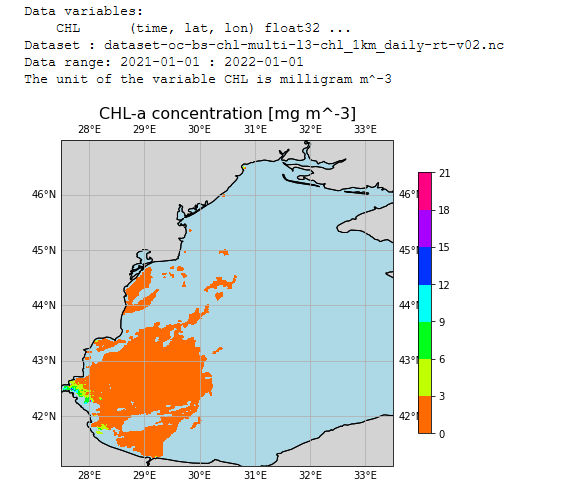

# Climatological-map-from-NetCDF-file
Climatological map from NetCDF file with Python

Generate climatological map from a NetCDF file (downloaded from CMEMS)

Option 1 : with xarray
   
Option 2: with netCDF4

